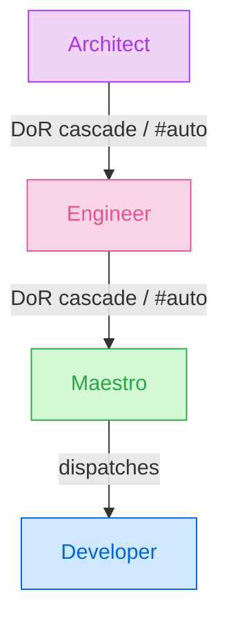

# Agents Architecture

This document is the canonical reference for the autoducks agent architecture: the command surface, the generic run flow, the four pipeline agents (Architect, Engineer, Maestro, Developer), the utility agents, branching, labels, provider abstractions, and directory layout.

---

## Command surface

```shell
/$trigger [model:$model] [effort:$effort] [turns:$turns] [#auto:$chain]
```

- **`/`** — the slash-command namespace, configurable via `command` in `.autoducks/autoducks.json` (default `/quack`). Changing it requires re-baking the workflow guards with `scripts/update-triggers.sh`.
- **`$trigger`** — a canonical verb (`architect`, `engineer`, `execute`, `fix`, `revert`, `close`), a built-in alias (`design`→architect, `tactics`→engineer, `run`/`work`→execute), or a per-team custom alias from `triggers.<agent>[]` in the config.
- **`model:`** — model override (`opus`, `sonnet`, `haiku`, or a full `claude-*` id). Bare aliases (`opus`) also work positionally.
- **`effort:`** — LLM effort override (`off`, `low`, `medium`, `high`, `max`). Bare aliases also work positionally. ("effort" follows the cross-provider convention — OpenAI `reasoning_effort`, Anthropic `output_config.effort`.)
- **`turns:`** — `max_turns` override (1–1000). `turns=N`, `max-turns=N`, and `max_turns=N` are also accepted.
- **`#auto:`** — agent chaining: `+`-separated verbs queued to run after this agent finishes, e.g. `/architect #auto:engineer+execute`. Verbs are deduplicated and capped at 5; a verb can appear at most once in a chain (loop protection).

All parsing lives in [`core/config/parse-directive.sh`](../core/config/parse-directive.sh); every downstream consumer sees canonical verbs.

---

## Authorization Gate (mandatory precondition)

**Every trigger-based workflow — every agent listed below, and every future agent added to the pipeline — MUST call the Authorization Gate as its first step, before any LLM invocation, comment, reaction, branch, or PR.**

The gate is the single choke point between an untrusted GitHub event (a `/$trigger …` comment on a public repo, a workflow dispatch) and a trusted action that spends the maintainer's LLM budget and mutates the repository.

- **Interface:** [`.autoducks/core/security/authorize.sh`](../core/security/authorize.sh) — run as the first workflow step. Non-zero exit (77) stops the workflow immediately.
- **Inputs:** the actor's login and `authorAssociation`, the agent key (`architect`, `engineer`, `execute`, `fix`, `revert`, `close`, …), and the `security` block from `.autoducks/autoducks.json`.
- **Policy:** deny list (beats everything, including OWNER) → allow list → trusted `authorAssociation` allowlist (default `OWNER`, `MEMBER`, `COLLABORATOR` — `CONTRIBUTOR` is deliberately excluded) → optional CODEOWNERS extension → default deny. Per-agent overrides via `security.per_agent`. Full schema is documented in the [Security reference](../../docs/src/content/docs/reference/security.mdx).
- The gate runs **before any feedback**: a denied actor never receives a "Running…" status comment, only the denial message.

**Rule for future agents:** any new agent, command verb, or trigger surface (labels, assignments, dispatch events) MUST include the Authorization Gate call as step 0 of its behavior, prior to reacting with 👀 or any other observable side effect.

---

## Generic run flow

Every slash-command run follows the same skeleton (security first, feedback always):

1. **Security gate** — `authorize.sh`, before any observable side effect.
2. **React** to the triggering comment with 👀 (`+1` on success, `confused` on failure — reactions always live on the *user's* comment).
3. **Post a bot-owned status comment** — ` **\`Agent\`**: running on [workflow #id](link)` — and **edit that same comment in place** as the run progresses (✅ finished / ⚠️ failed / 🔁 delegated). The user's comment is never edited, which keeps the revert agent's "delete bot comments, preserve human content" model intact. Module: [`core/feedback/status-comment.sh`](../core/feedback/status-comment.sh); requires `its::update_comment`.
4. **Definition-of-Ready guards** — distinct from the security gate. When an agent is not ready, it **auto-dispatches its prerequisite agent** and re-queues itself (plus any pending `#auto:` chain) behind it via [`core/orchestration/dispatch-chain.sh`](../core/orchestration/dispatch-chain.sh). Chains are depth-capped and loop-protected.
5. **Apply the layer's in-progress label** to the issue.
6. **Run the agent's specific workflow** (LLM step for Architect/Engineer/Developer/Fix; pure orchestration for Maestro/Revert/Close).
7. *(Future)* wrap the agentic workflow in a verification loop against a definition of done.
8. **Edit the status comment** to ✅ with the friendly outcome details and the `_Ran with \`model\` at effort \`level\`._` footer.
9. **Apply the layer's done label** and **assign the command author** to the issue — the assignee always marks who owns the next action (D15).

Failures never end as a silent red X: [`core/feedback/notify-failure.sh`](../core/feedback/notify-failure.sh) posts a categorized diagnosis (merge-conflict / no-changes / scope-missing / parse / max_turns / infra) with a run-log link and a retry hint, mirrored to the parent feature when a task fails.

### Re-run semantics

There is no separate resume path: **re-issuing the same trigger comment is always the intended way to resume, refine, or correct a run**, because every agent recomputes its behavior from currently-visible ITS/git state rather than any workflow-local cache. Concretely: the Architect revises the existing body instead of rewriting it and preserves the tactical zone byte-for-byte; the Engineer's `Tactics:done` re-run is revision mode (existing tasks preserved by number, dropped tasks closed as superseded); the Maestro is fully idempotent (reuses the pipeline branch/PR, never re-dispatches a task with an open or merged PR); and the utility agents (Fix/Revert/Close) are idempotent teardown/repair operations. See the [Re-running agents](../../docs/src/content/docs/guides/re-running-agents.mdx) guide for the full per-stage contract.

---

## Pipeline agents



| | **Architect** | **Engineer** | **Maestro** | **Developer** |
|---|---|---|---|---|
| **Purpose** | (Design) Creates **or revises** the design of features and bugs | (Tactics) Creates the execution plan: tasks + dependency waves | (Orchestration) Coordinates parallel execution waves | (Build) Implements one task |
| **Trigger phrases** | `architect`, `design` | `engineer`, `tactics` — or `execute`/`run`/`work` on an unplanned issue | `execute`, `run`, `work` on an issue with `Tactics:done` | `execute`, `run`, `work` on a Task issue |
| **Definition of Ready** | none (any issue) | issue has `Design:done` | issue has `Tactics:done` | Task with a parent whose pipeline branch exists |
| **Auto-dispatch when not ready** | — | Architect (`architect #auto:engineer[+…]`) | Engineer (`engineer #auto:execute`) | Maestro on the parent issue |
| **Stage labels** | `Design:draft` → `Design:done` | `Tactics:crafting` → `Tactics:done` | `Work:orchestrating` → `Work:done` | `Work:coding` → `Work:done` |
| **Definition of Done** | structured design in the body; type/label `Feature` or `Bug` | plan + subtasks created/linked | all subtasks closed, final PR ready | task PR merged into the pipeline branch; task closed |

The same `execute` comment is claimed by exactly **one** workflow via label/type routing (the user never has to know which): Task issue → Developer; `Tactics:done` → Maestro; anything else → Engineer (whose DoR guard cascades to the Architect when the design is missing). A raw `/execute` on a fresh issue therefore runs the whole pipeline: Architect → Engineer → Maestro → Developers.

### Architect (design layer)

1. Preserve the tactical zone byte-for-byte if the body already has one (abort loudly on malformed markers).
2. **[AGENT]** Create the specification — or **revise/structure an existing design** — with sections: Problem Statement / Proposed Solution / Technical Design / Dependencies / Constraints / Out of Scope. Classify the issue as `Feature` or `Bug`.
3. Publish the new design zone (+ preserved tactical zone) to the issue body.
4. Set the native issue type and label to `Feature` or `Bug` (label is route-critical; type is best-effort, org-only). Remove `Draft` if present.
5. `Design:draft` → `Design:done`; assign the command author; continue the `#auto:` chain.

There is **no** auto-trigger by the `Draft` label (D13) — entry is by command or cascade only.

### Engineer (tactics layer)

1. **DoR:** requires `Design:done`, else delegates to the Architect with itself re-queued.
2. **[AGENT]** Produce the tactical plan **inside the tactical zone** (`<!-- autoducks:tactical:begin/end -->`); the design zone above is never rewritten. Plan = YAML `waves:` block + `## Tasks` blocks + `## Progress` checklist. **Questions Mode**: when the design is insufficient, post up to 5 blocking questions and stop instead of guessing.
3. Parse deterministically ([`core/robustness/parse-plan.py`](../core/robustness/parse-plan.py)); reconcile child Task issues (create/update/close dropped ones), link as native sub-issues with graceful degradation, replace `Tn` placeholders with real numbers.
4. **Single-task plans** create no child issue and no special label — the task lives in the tactical zone and the Maestro detects the case structurally (no waves block).
5. `Tactics:crafting` → `Tactics:done` (one label: completion record **and** routing signal). Re-running the Engineer on a `Tactics:done` issue is **revision mode** (existing tasks preserved by number, dropped ones closed as superseded).
6. Assign the command author; continue the chain (an `execute`-routed run implicitly chains to `execute`).

The Engineer is **pure ITS** — it never touches git (D7).

### Maestro (orchestration layer)

1. **DoR:** requires `Tactics:done`, else delegates to the Engineer with `#auto:execute`.
2. **Owns all pipeline git** (D7): ensures the pipeline branch — `feature/<slug>` for Features, `fix/<slug>` for Bugs (D10) — cut from `base_branch`, and the **draft PR** into `integration_branch`.
3. Computes wave states from merged task PRs (`fixes #N` bodies), ticks the `## Progress` checkboxes, and dispatches the next eligible wave of Developers (`autoducks-developer.yml` via `workflow_dispatch`), propagating model/effort/turns overrides and the original actor. Three independent guards prevent duplicate dispatch (open-PR check, Developer pre-flight skip, per-task concurrency group).
4. **Advancement is event-driven**: every PR merged into a `feature/*` or `fix/*` branch re-triggers the Maestro, which recomputes and continues. No polling.
5. When every wave is done: rebuilds the final PR body (`Closes #…` + a `## Work Log` harvested from each task PR's Implementation Summary), marks the PR ready, requests review from the issue assignees, `Work:orchestrating` → `Work:done`, assigns the command author.
6. Single-task fast path: dispatches the Developer on the feature issue itself.

### Developer (build layer)

1. **DoR (D1):** a Task must have its pipeline context. When invoked by comment without one, it resolves the parent issue; if the parent branch is missing it delegates to the Maestro on the parent. Parentless standalone execution was retired — the pipeline guarantees a reviewed design and plan before code.
2. Cuts a task branch from the pipeline branch, inheriting its prefix: `<feature|fix>/<parentNum>-issue-<taskNum>-<epoch>`.
3. **[AGENT]** Implements the task spec (never runs git/gh itself); writes `/tmp/work-summary.md`.
4. Opens the task PR into the pipeline branch (`fixes #N` + Implementation Summary) and **auto-merges** it (adaptive method: `auto` probes merge/squash/rebase; 3 attempts with rebase in between; conflicts → `notify_conflict`).
5. Closes the task explicitly (sub-PR merges don't fire GitHub's auto-close), `Work:coding` → `Work:done`, assigns the command author.
6. On `max_turns` exhaustion: commits `WIP:`, pushes the branch, and reports it — `/fix` resumes from the preserved branch.

> **Auto-merge policy:** task PRs merge into a pipeline branch that itself undergoes human review before reaching `integration_branch`. Manually-dispatched tasks against the default branch are **not** auto-merged.

---

## Utility Agents

Utility agents handle recovery, cleanup, and lifecycle operations. They are not part of the planning-to-execution pipeline and have no stage labels.

### Fix Agent

**Verb:** `fix` — re-runs/repairs a failed task: finds the newest existing task branch (either prefix), reads the failure context (last 10 comments), fixes on top of the partial work, reuses or opens the PR, single-attempt merge when under a parent. This is **not** the Bug flow — Bugs go through the full pipeline (D10).

### Revert Agent

**Verb:** `revert` — undoes a feature: closes child tasks as not-planned, strips pipeline labels (current and legacy), restores the last **human-authored** body revision via the edit history, and deletes only bot comments. Security default: `OWNER`, `MEMBER`.

### Close Agent

**Verb:** `close` — tears a finished pipeline down: closes child tasks and PRs, deletes task and pipeline branches (both prefixes), strips labels, closes the issue with a cleanup summary. Security default: `OWNER`, `MEMBER`.

---

## Provider Abstraction

autoducks is designed to be platform-agnostic. All external interactions go through three provider interfaces:

| Provider | Prefix | Responsibility | Default implementation |
|----------|--------|----------------|----------------------|
| **ITS** (Issue Tracking System) | `its::` | Issues, PRs, labels, comments, assignments | GitHub (via `gh` CLI) |
| **Git** | `git::` | Branches, commits, merges, repository operations | Git CLI |
| **LLM** | `llm::` | Agent reasoning, plan generation, code writing | Claude Code |

Each provider exposes a set of functions behind a stable interface (`providers/{its,git}/interface.sh` validates the contract at source time). Swapping providers requires implementing the same function signatures without changing agent logic. The full required-function lists live in the interface files; notable additions for the status-comment flow: `its::update_comment(comment_id, body)` and `its::assign_issue(issue_id, assignee)`.

---

## Branch Naming

All branches follow a predictable convention rooted in issue IDs. The prefix encodes the issue kind (D10).

| Context | Pattern | Example |
|---------|---------|---------|
| Feature pipeline branch | `feature/<number>-<slug>` | `feature/42-user-auth` |
| Bug pipeline branch | `fix/<number>-<slug>` | `fix/57-login-crash` |
| Task under a pipeline branch | `<feature\|fix>/<parent>-issue-<task>-<epoch>` | `feature/42-issue-43-1751941200` |
| Fix-utility retry branch | `<feature\|fix>/<parent>-issue-<task>-fix-<epoch>` | `feature/42-issue-43-fix-1751943000` |

The Maestro's PR-merged re-trigger listens on both `feature/*` and `fix/*`. The fix-utility `-fix-<epoch>` suffix is unrelated to the `fix/` prefix.

---

## Labels

| Label | Meaning |
|-------|---------|
| `Draft` | Optional human marker: issue still needs design work (removed by the Architect) |
| `Feature` / `Bug` | Routing + classification — set as a label (route-critical) and as the native issue type (best-effort, org-only) |
| `Task` | Marks a task issue split from a plan — label + best-effort native type |
| `Design:draft` | Architect is writing the design |
| `Design:done` | Design complete (Engineer's Definition of Ready) |
| `Tactics:crafting` | Engineer is building the plan |
| `Tactics:done` | Plan complete — also the Maestro's routing signal and the Engineer's revision-mode marker |
| `Work:orchestrating` | Maestro is coordinating waves on this issue |
| `Work:coding` | Developer is implementing this task |
| `Work:done` | Work complete (task merged, or all waves finished) |

Retired (cleaned up on sight by revert/close/engineer): `Spec:draft`, `Spec:plan`, `Tactics:ready`, `Ready`, `Work:progress`, `Tactics:single`, `priority:P0..P3`.

---

## Directory Structure

```
.autoducks/
  autoducks.json          # Project configuration: command prefix, providers,
                          # defaults (model/effort/branches/merge), triggers, security
  assets/                 # Static assets (status-comment loading.gif)
  design/
    AGENTS.md             # This document — canonical agent architecture reference
  agents/
    architect/            # defaults.json + prompt.md + pre.sh/post.sh
    engineer/             # defaults.json + prompt.md + pre.sh/post.sh
    maestro/              # defaults.json + run.sh (no LLM)
    developer/            # defaults.json + prompt.md + pre.sh/post.sh
    fix/                  # defaults.json + prompt.md + pre.sh/post.sh
    revert/               # defaults.json + run.sh (no LLM)
    close/                # defaults.json + run.sh (no LLM)
  core/
    config/               # load-config, load-agent-defaults, parse-directive,
                          # generate-trigger-conditions
    feedback/             # status-comment, progress-labels, react-to-comment,
                          # notify-failure, update-checkboxes
    orchestration/        # dispatch-chain, branch-prefix, parse-waves,
                          # reconcile-tasks, tactical-zone, create-final-pr,
                          # prevent-duplicate-dispatch, build-revision-context
    robustness/           # parse-plan.py, ask-questions, assert-changes,
                          # wait-for-branch, retry-on-parse-failure
    security/             # authorize, parse-codeowners, resolve-team
  providers/
    its/                  # ITS provider implementations (github/)
    git/                  # Git provider implementations (github/)
    llm/                  # LLM provider implementations (claude/)
  runtimes/
    github-actions/       # Canonical workflow templates (mirrored to .github/workflows/)
```
